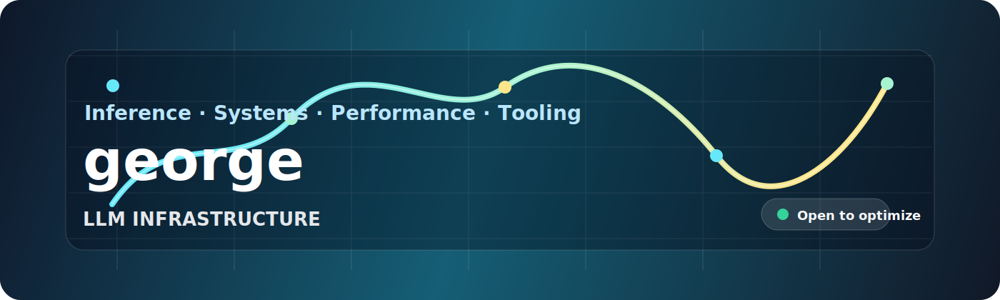

<p align="right">
  <a href="./README.md">English</a> · <strong>中文</strong>
</p>

<div align="center">
  
</div>

<h1 align="center">george</h1>

<p align="center">
  <strong>LLM 基础设施 · 推理系统 · 底层性能优化</strong>
</p>

<p align="center">
  <a href="https://github.com/georgezhong10-cmyk">
    
  </a>
  <a href="mailto:georgezhong10@gmail.com">
    
  </a>
  
</p>

<p align="center">
  关注大模型与真实延迟预算之间的运行时基础设施。
</p>

---

### 关注方向

| 方向 | 我关心的问题 |
| --- | --- |
| LLM 推理服务 | 吞吐、尾延迟、批处理、调度、可观测性 |
| 性能优化 | profiling、内存布局、kernel 行为、CPU/GPU 瓶颈 |
| 基础设施 | 可靠部署、可复现实验、基准测试和工程工具 |
| 系统学习 | 把复杂运行时细节整理成可读的笔记与实验 |

### 当前方向

```text
profile:
  name: george
  handle: georgezhong10-cmyk
  interests:
    - LLM 推理基础设施
    - 底层性能优化
    - 分布式推理服务
    - profiling 与 benchmark 工具
  bias:
    - 先测量，再优化
    - 让抽象保持诚实
    - 让快路径可理解、可复现
```

### 技术栈

<p align="center">
  
</p>

<p align="center">
  
  
  
  
</p>

### 接下来想构建

| 方向 | 仓库想法 | 产出 |
| --- | --- | --- |
| 推理笔记 | `llm-inference-notes` | 可读笔记、架构图、benchmark 记录 |
| Kernel 实验 | `kernel-playground` | C++/CUDA/Rust 小型性能实验 |
| 基础设施工具 | `infra-toolkit` | profiling、监控、调试脚本 |

### GitHub 信号

| 信号 | 状态 |
| --- | --- |
| 主页定位 | LLM 基础设施与底层性能优化 |
| 公开路线 | 推理笔记、kernel 实验、基础设施工具 |
| 合作方向 | 模型服务、基准测试、性能分析、运行时优化 |
| 仓库主页 | [github.com/georgezhong10-cmyk](https://github.com/georgezhong10-cmyk) |

### 欢迎交流

欢迎围绕 LLM 系统、推理性能、profiling 工具、benchmark 设计和实用开源基础设施交流合作。

<p align="center">
  <sub>让 AI 系统更快、更简单，也更容易理解。</sub>
</p>
